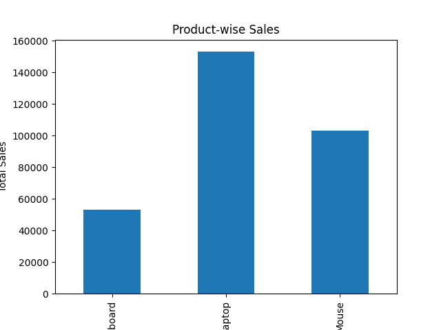
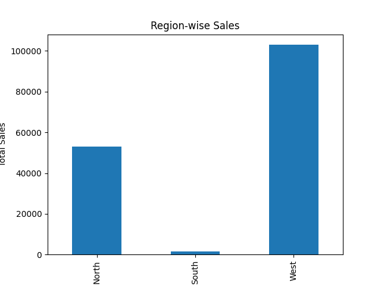
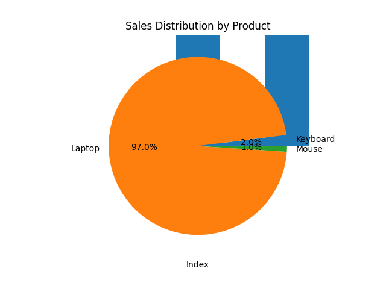
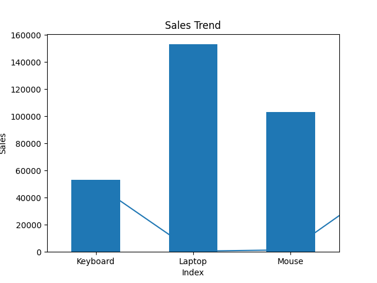

Project: E-commerce Sales Analysis

Tools Used:
- Python
- Pandas

Key Analysis:
- Total sales calculation
- Product-wise and region-wise sales
- Top customer identification

Insights:
- Laptop generates highest revenue
- North region contributes most sales
- Customer A is top buyer
  
## 📊 Data Visualization
- Bar chart for product-wise sales
- Bar chart for region-wise sales
- Pie chart for sales distribution
- Line chart for sales trend
### Product-wise Sales

### Region-wise Sales

### Sales Distribution

### Sales Trend

- 
